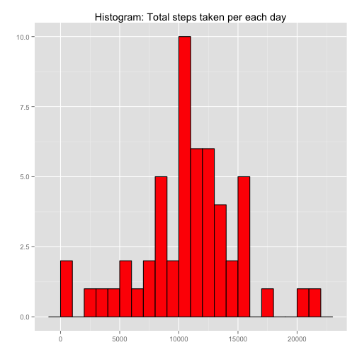
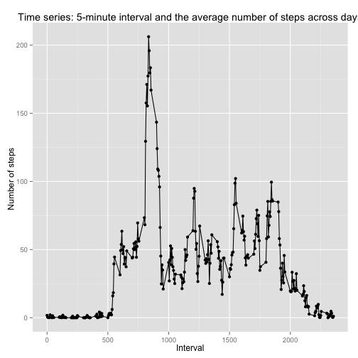
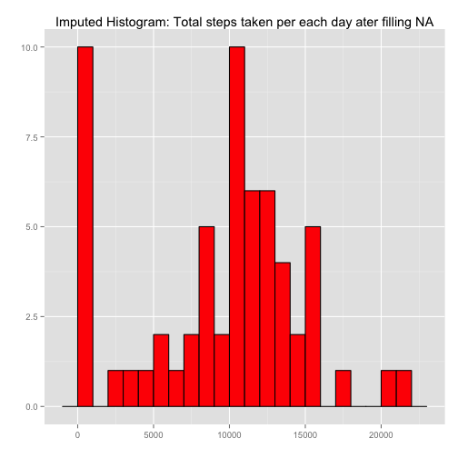
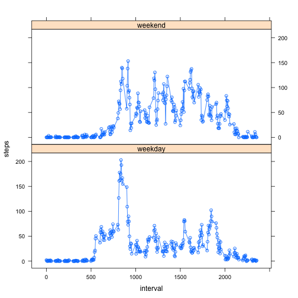

## Loading and preprocessing the data
Load the data into R.


```r
# Read data set (df) from the working directory
df <- read.csv("./activity.csv", stringsAsFactors = FALSE)
```

## What is mean total number of steps taken per day?
For this part of the assignment, you can ignore the missing values in the dataset.

1.  Calculate the total number of steps taken per day

2.  If you do not understand the difference between a histogram and a barplot, research the difference between them. Make a histogram of the total number of steps taken each day

3.  Calculate and report the mean and median of the total number of steps taken per day


```r
#Remove NA's
df.na.removed = df[complete.cases(df),]
total.steps.taken.grouped.by.day = aggregate(steps~date, data=df.na.removed , FUN = sum)

library(ggplot2)
ggplot(total.steps.taken.grouped.by.day, aes(x = steps)) + 
  geom_histogram(binwidth=1000, fill = "red", colour = "black") + 
  labs(title = "Histogram: Total steps taken per each day") + labs(x = "", y = "")
```

 

```r
mean.steps.taken.per.day = mean(total.steps.taken.grouped.by.day$steps)
median.steps.taken.per.day = median(total.steps.taken.grouped.by.day$steps)

print(paste('Mean steps taken per day:', mean.steps.taken.per.day))
```

```
## [1] "Mean steps taken per day: 10766.1886792453"
```

```r
print(paste('Median steps taken per day:', median.steps.taken.per.day))
```

```
## [1] "Median steps taken per day: 10765"
```


## What is the average daily activity pattern?
1.  Make a time series plot (i.e. type = "l") of the 5-minute interval (x-axis) and the average number of steps taken, averaged across all days (y-axis)

2.  Which 5-minute interval, on average across all the days in the dataset, contains the maximum number of steps?


```r
avg.daily.interval.steps = aggregate(steps~interval, data=df.na.removed , FUN = mean)
max.steps = max(avg.daily.interval.steps$steps)
interval.with.max.steps = avg.daily.interval.steps[avg.daily.interval.steps$steps == max.steps,]$interval
print(paste('Interval with max steps of', max.steps, ':', interval.with.max.steps))
```

```
## [1] "Interval with max steps of 206.169811320755 : 835"
```

```r
qplot(interval, steps, data = avg.daily.interval.steps) + geom_line() + labs(title = "Time series: 5-minute interval and the average number of steps across days") +labs(x = "Interval", y = "Number of steps ")
```

 

## Imputing missing values
Note that there are a number of days/intervals where there are missing values (coded as NA). The presence of missing days may introduce bias into some calculations or summaries of the data.

1.  Calculate and report the total number of missing values in the dataset (i.e. the total number of rows with NAs)

2.  Devise a strategy for filling in all of the missing values in the dataset. The strategy does not need to be sophisticated. For example, you could use the mean/median for that day, or the mean for that 5-minute interval, etc.

3.  Create a new dataset that is equal to the original dataset but with the missing data filled in.

4.  Make a histogram of the total number of steps taken each day and Calculate and report the mean and median total number of steps taken per day. Do these values differ from the estimates from the first part of the assignment? What is the impact of imputing missing data on the estimates of the total daily number of steps?

```r
na.row.count = nrow(df) - nrow(df.na.removed)
print (paste('Total rows containing NA:',na.row.count))
```

```
## [1] "Total rows containing NA: 2304"
```

```r
#Impute values using median
imputed.df = df
for (i in which(sapply(df, is.numeric))) {
    print(i)
    imputed.df[is.na(imputed.df[, i]), i] = median(imputed.df[, i],  na.rm = TRUE)
}
```

```
## [1] 1
## [1] 3
```

```r
# Validate imputation
is.valid = (nrow(df) - nrow(imputed.df)) == 0
print (paste('Imputed is valid:', is.valid))
```

```
## [1] "Imputed is valid: TRUE"
```

```r
#Compare to non imputed
imputed.total.steps.taken.grouped.by.day = aggregate(steps~date, data=imputed.df , FUN = sum)

#Plot Histogram
library(ggplot2)
ggplot(imputed.total.steps.taken.grouped.by.day, aes(x = steps)) + 
  geom_histogram(binwidth=1000, fill = "red", colour = "black") + 
  labs(title = "Imputed Histogram: Total steps taken per each day ater filling NA") + labs(x = "", y = "")
```

 

```r
# Calcuate mean and median
imputed.mean.steps.taken.per.day = mean(imputed.total.steps.taken.grouped.by.day$steps)
imputed.median.steps.taken.per.day = median(imputed.total.steps.taken.grouped.by.day$steps)

# Print the impact of imputation on mean
print(paste('Imputed Mean steps taken per day:', imputed.mean.steps.taken.per.day))
```

```
## [1] "Imputed Mean steps taken per day: 9354.22950819672"
```

```r
dff.in.mean = imputed.mean.steps.taken.per.day - mean.steps.taken.per.day
print(paste('Difference between imputated in Mean steps taken per day:', dff.in.mean))
```

```
## [1] "Difference between imputated in Mean steps taken per day: -1411.95917104856"
```

```r
# Print the impact of imputation on median
print(paste('Imputed Median steps taken per day:', imputed.median.steps.taken.per.day))
```

```
## [1] "Imputed Median steps taken per day: 10395"
```

```r
dff.in.median = imputed.median.steps.taken.per.day - median.steps.taken.per.day
print(paste('Difference between imputated in Median steps taken per day:', dff.in.median ))
```

```
## [1] "Difference between imputated in Median steps taken per day: -370"
```

## Are there differences in activity patterns between weekdays and weekends?
For this part the weekdays() function may be of some help here. Use the dataset with the filled-in missing values for this part.

1.  Create a new factor variable in the dataset with two levels – “weekday” and “weekend” indicating whether a given date is a weekday or weekend day.

2.  Make a panel plot containing a time series plot (i.e. type = "l") of the 5-minute interval (x-axis) and the average number of steps taken, averaged across all weekday days or weekend days (y-axis). See the README file in the GitHub repository to see an example of what this plot should look like using simulated data.

```r
#Create a day_type factor column  with either 'weekend' or 'weekday'
imputed.df.with.day.type = imputed.df
weekdays.with.day <- weekdays(as.Date(imputed.df.with.day.type$date))
imputed.df.with.day.type$day_type <- sapply(weekdays.with.day, function(day.of.week) {
    if (day.of.week %in% c("Saturday", "Sunday")) {
        return("weekend")
    } else {
        return("weekday")
    }
})

# Caluclate mean steps by day_type
mean.steps.by.interval.day = aggregate(steps~interval+day_type, data=imputed.df.with.day.type, FUN=mean)

#Panel plot
library(lattice)
xyplot(steps ~ interval | day_type, data = mean.steps.by.interval.day , type = "b", layout = c(1, 2))
```

 
